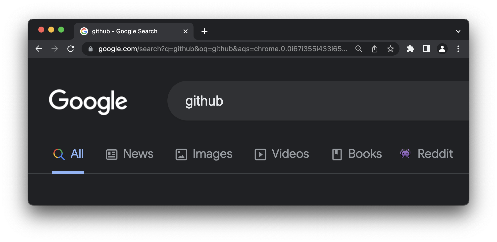

  
  <h1>Search Reddit</h1>

Search Reddit is a handy browser extension that lets you easily search for content on Reddit right from the Google tab bar.

<!-- 

  
  

 -->

  

## Installation (Chrome or Microsoft Edge)

- **[Download](https://github.com/dephraiim/minimal-youtube/releases/download/v1.0.1/minimal_youtube-1.0.1.zip)** the zip from the Github Releases or **Fork** this repo, then **clone your forked repo locally**.
- **Open [the extensions page](chrome://extensions)** in Chrome: `chrome://extensions`.
- If you did not do it already, **toggle the "developer mode"**. This is usually a toggle button at the top right of the extensions page.
- Click the button **_load unpacked extension_**.
- In the window that pops up, **select the folder that contains this minimal extension**, then **click _ok_**.
- **Done!** A new extension called _Minimal Youtube_ should have appeared in the list.

## Installation (Firefox)

- **[Download](https://github.com/dephraiim/minimal-youtube/releases/download/v1.0.1/minimal_youtube-1.0.1.zip)** the zip from the Github Releases.
- **Open the temporary extensions page** in Firefox: `about:debugging#/runtime/this-firefox`
- Click the button **_Load Temporary Add-on..._**
- In the window that pops up, **select the folder that contains the downloaded extension**, then **click _ok_**.
- **Done!** A new extension called _Minimal Youtube_ should have appeared.

## License

MIT
